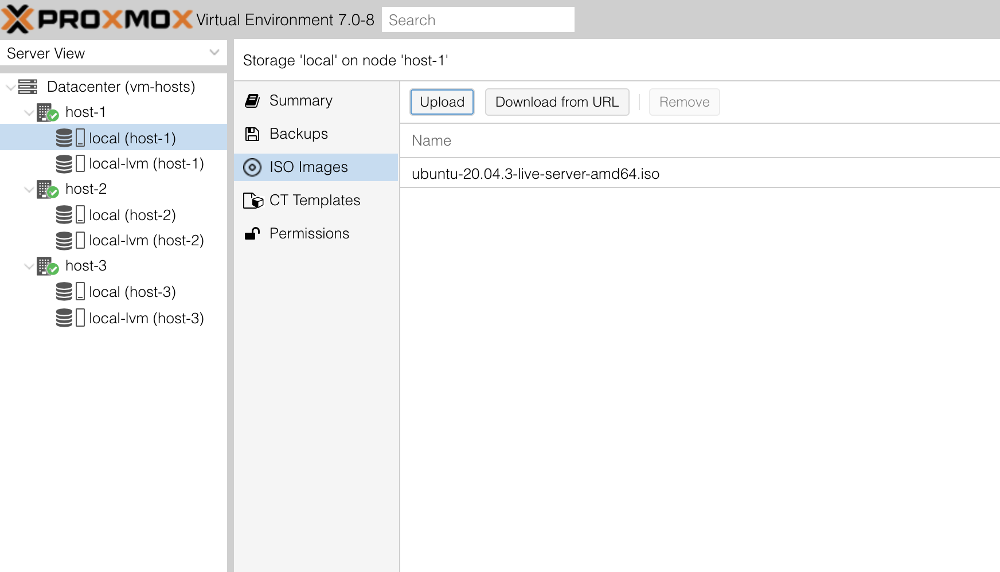

Up until now I have been managing my local VMs with *KVM*, *Quemu* and *libvirt*, using headless Ubuntu 20.04 LTS on the hosts as well as on the VMs,
creating the VMs using scripts and [cloud init](https://cloudinit.readthedocs.io/en/latest/) files, and periodically updated the VMs and the hosts manually.

I have 3 decent physical machines (i7 with 16 cores and 64 GB memory) at my disposal and want to use them to run a local Kubernetes cluster. As I am still experimenting with Kubernetes, I want to be able to run multiple clusters on those machines and easily create and destroy them. For now, using VMs as nodes seems to make sense. At a later point I might scrap it all and go for a bare metal single cluster approach.

For now, it would be nice to make it easier to manage my VMs, and for that reason, I'll do an experiment with [Proxmox VE](https://www.proxmox.com/en/proxmox-ve).

### Preparation

The first step is to install Proxmox VE on each of the 3 machines.

After [downloading](https://www.proxmox.com/en/downloads) the ISO image and the admin manual, it's time to create a USB stick.

Following the instructions on my Mac, convert the *.iso* file to *.img*
```bash
hdiutil convert -format UDRW -o proxmox-ve_7.0-1.dmg proxmox-ve_7.0-1.iso
```

Then determine which disk it is:
```bash
diskutil list
```

And unmount it:
```bash
diskutil unmountDisk /dev/disk2
```

Finally, write the dmg file to the USB stick:
```bash
sudo dd if=proxmox-ve_7.0-1.dmg of=/dev/rdisk2 bs=1m
```
And this is where the fun starts :) with the following error:
```bash
dd: proxmox-ve_7.0-1.dmg: Operation not permitted
```

A bit of googling brought me to [this post](https://osxdaily.com/2018/10/09/fix-operation-not-permitted-terminal-error-macos/) with a solution, giving 'Full Disk Access' to iTerm. It's kind of hard to believe that I did not run into this before.


### Install Proxmox VE

Not that the USB stick is ready, it's time to do some installations.

Once booted, the first step of the installation process is straight forward. For now, I selected *xfs* as file system, as it seems to be the best fit for my use case, and choose the biggest and fastest disk as starting point. I also configure each server with a fixed IP.

Once rebooted, a friendly message shows up requesting to use a web browser to configure the server. After having done so, the next step is to configure the repositories. Navigate to the host/Updates/Repositories, add the No Subscription repository and disable the enterprise repository:


As I had some spare SSDs available, I want to see if they can be used by VMs as well. For now, let's create a logical volume group for them.
Open the shell and list the available physical disks using:
```bash
lsblk -d
```
In my case, I have 4 additional disks: sda, sdb, sdc and sdd.
So, let's go ahead and create physical volumes for them:
```bash
pvcreate /dev/sda /dev/sdb /dev/sdc /dev/sdd
```
Then create a single volume group:
```bash
vgcreate vm-data /dev/sda /dev/sdb /dev/sdc /dev/sdd
```
And create a logical volume:
```bash
lvcreate -L 500G -T -n vm-data vm-data
```
Then go ahead and follow the same steps on the other two hosts.

### Clustering the Proxmox servers

From one of the servers, navigate to *Data Center/Cluster* and chose to create a cluster. Give it a valid name, I chose *vm-hosts* for now.
Once completed, click on *Join Information* and copy the join information.

Then, on the other servers, navigate to *Data Center/Cluster* chose to join a cluster. Enter the join information and the original host's root password and wait for the process to complete. Once completed, all 3 hosts show up and can be managed from any of the instances:


### Create a VM

Let's finish up with creating a simple VM.

Download the latest Ubuntu release from https://ubuntu.com/download (or pick any other iso you want to use). Select a host, navigate to one of its storage options and go to ISO images. Upload the image so it is ready to be used:



Now create a VM on that host. The options should be pretty self-explanatory, have a look at the proxmox documentation for the details. I keep it simple for my first VM and use the default settings in most places. I decide to give it a 20GB hard drive, 2 cores and 4GB of memory. I'll leave the VirtIO paravirtualized network selected for now and select to start it after it is created:


The VM is created and after a short wait, the Console can be used to go through the installation process.

### Next Steps...

Plenty of ways to go from here. From using cloud init files to automate the installation process to trying out if terraform would also be an option.

As for me, the main reason to set this up was to prepare for some experiments running Kubernetes with [Talos](https://www.talos-systems.com/). Let's see how that works out!