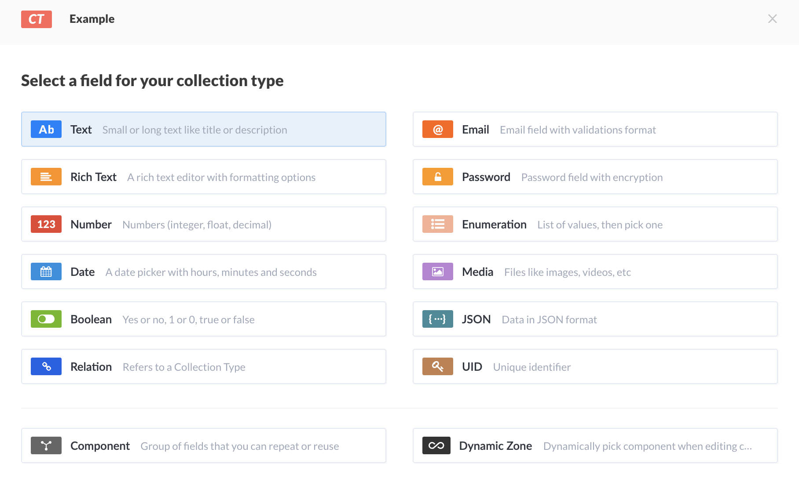

The goal of my [Rapid API project](/project/rapid-api) is to create a containerized starting point that can be used to quickly implement a prototype of an API, customize it as needed, and easily add initial content.

## Preparation

To get started, create a new GitHub repository, initialized it with a README and a license, and clone it to your local machine.

## Docker files

Add a _docker-compose.yaml_ file with the following content:

```yaml
version: '3.7'
services:
  rapid-api:
    container_name: api-dev
    build: ./docker/sqlite
    ports:
      - '8080:8080'
```

This file points to a Dockerfile in the _/docker/sqlite_ folder and maps container port 8080 to host port 8080 so we can access our API.

Next, add a _docker_ folder with a _sqlite_ sub folder. There, create a _Dockerfile_ with the following content:
```dockerfile
FROM node:13.14.0-alpine3.11

RUN apk update && apk upgrade 
RUN yarn global add strapi

WORKDIR /app

RUN strapi new . --quickstart --no-run 
RUN yarn install --force
RUN strapi install documentation && strapi install graphql

RUN sed -i 's/1337/8080/g' ./config/server.js

COPY settings.json /app/extensions/documentation/config/
COPY entrypoint.sh /usr/local/bin/

RUN chmod 755 "/usr/local/bin/entrypoint.sh"

EXPOSE 8080

ENTRYPOINT ["/usr/local/bin/entrypoint.sh"]
```

As you can see, the Dockerfile uses the latest Node JS 13 version.
At the time of writing, Node JS 14 has already been released, but not all of strapi's dependencies were available at the time of writing.

The docker build starts with installing the strapi CLI, which it then uses to create a new quickstart project.
This initializes a strapi project using a [SQLite](https://www.sqlite.org/index.html) database.
It then installs the [API documentation](https://strapi.io/documentation/v3.x/plugins/documentation.html) and [GraphQL](https://strapi.io/documentation/v3.x/plugins/graphql.html) plugins and changes the default port number from 1337 to 8080.
In addition, it copies a _settings.json_ file and an _entrypoint.sh_ file to the image.

## Open API settings

Next to the _Dockerfile_ in the _sqlite_ folder, add a _settings.json_ file with the following content:
```json
{
    "openapi": "3.0.0",
    "info": {
      "version": "1.0.0",
      "title": "DOCUMENTATION",
      "description": "",
      "termsOfService": "YOUR_TERMS_OF_SERVICE_URL",
      "contact": {
        "name": "TEAM",
        "email": "contact-email@something.io",
        "url": "mywebsite.io"
      },
      "license": {
        "name": "Apache 2.0",
        "url": "https://www.apache.org/licenses/LICENSE-2.0.html"
      }
    },
    "x-strapi-config": {
      "path": "/documentation",
      "showGeneratedFiles": true,
      "pluginsForWhichToGenerateDoc": [
        "email",
        "upload",
        "users-permissions"
      ]
    },
    "servers": [
      {
        "url": "http://localhost:8080",
        "description": "Development server"
      },
      {
        "url": "YOUR_STAGING_SERVER",
        "description": "Staging server"
      },
      {
        "url": "YOUR_PRODUCTION_SERVER",
        "description": "Production server"
      }
    ],
    "externalDocs": {
      "description": "Find out more",
      "url": "https://strapi.io/documentation/"
    },
    "security": [
      {
        "bearerAuth": []
      }
    ],
    "paths": {},
    "tags": [],
    "components": {}
}
```
This file is needed in order to correct the port number used by the Open API endpoint. Feel free to edit the other settings to your liking.
For more info, see [this section](https://strapi.io/documentation/v3.x/plugins/documentation.html#installation) in the strapi documentation.

## Entrypoint

Next to the _Dockerfile_ in the _sqlite_ folder, add an _entrypoint.sh_ file with the following content:
```bash
#!/bin/sh

# exit when any command fails
set -e

echo "Starting Server"

strapi develop
```
This entrypoint script simply starts the strapi project in development mode, with automatic reload enabled.

## First run

Startup the container for the first time:
```bash
docker-compose up --build
```

It will take a while before we are ready for the next steps. The base image is downloaded, updates are installed, the strapi project is initialized and the Documentation and GraphQL plugins are installed. Once this is completed, the container is started and some log entries appear.
Eventually you will see something like this, indicating that the container is successfully started:
```plaintext
api-dev      | One more thing...
api-dev      | Create your first administrator 💻 by going to the administration panel at:
api-dev      |
api-dev      | ┌──────────────────┐
api-dev      | │ http://localhost:8080/admin  │
api-dev      | └──────────────────┘
api-dev      |
```

You are now read to navigate to [http://localhost:8080/admin](http://localhost:8080/admin), create an admin account and start customizing your API.

## Adding Content

Let's add a first example resource together.

From the menu on the left, select the _Content-Types Builder_ and choose _Create new collection type_.
Give it a display name _Example_ and continue. Now we can add our choice of fields to our collection type:

As you can see, strapi comes with a nice set of built-in field types. Feel free to experiment with them.
For now, we will just add a Text field called _Name_ and a Rich Text field called _Description_.
Hit _Finish_ and then _Save_. Strapi will now generate the _Example API_ and restart the server.
Once complete, you will see the _Example_ collection type appear in the top left.
Open it up and add a few examples.

Checkout the [strapi documentation](https://strapi.io/documentation/v3.x/getting-started/introduction.html) and [tutorials](https://strapi.io/tutorials) for more examples.

## Test the API

Now that we have added some content and created our first API, we want to see it in action.
You can use the API client of your choice to test it (postman, [insomnia](https://insomnia.rest/), curl, etc,)
At the moment, I prefer to use Visual Studio Code with the [REST Client](https://marketplace.visualstudio.com/items?itemName=humao.rest-client) plugin.
Add a _test.http_ file with the first test:
```http
###
GET http://localhost:8080/examples
```
A little _Send Request_ label will appear, and when you click that, Visual Studio Code will execute the GET request.
You will get a response like this:
```http
HTTP/1.1 403 Forbidden
...
Connection: close

{
  "statusCode": 403,
  "error": "Forbidden",
  "message": "Forbidden"
}
```
Your API supports authentication and is not open to the public!
For the sake of this test, in your strapi Admin UI, navigate to _Roles & Responsibilities_, select _Public_ and check _Select All_ next to _Example_ and save that.


Now try sending the request again, you should receive the examples that you've added previously.

For our last exercise, let's use the API to add another entry.
Add the following to the _test.http_ file:

```http
###
POST http://localhost:8080/examples
content-type: application/json

{
  "name": "API Example",
  "description": "Added using the API"
}
```

Don't forget the content-type header! Strapi will check for this and create an entry with empty values if you forget to specify that!

## API Documentation

You will find another nice feature of our setup when you navigate to _Documentation_. Click in the _Retrieve your jwt token_ textbox and the token will be copied to the clipboard. Click on _Open the documentation_ and the Swagger based OpenAPI endpoint will be opened. You can _Authorize_ yourself with your token and get familiar with all the options that your API has to offer.

## GraphQL

A main reason for me to try strapi for rapid API prototyping is its support for GraphQL.
I am not yet very familiar with GraphQL and want to have a playground to learn more.

Your API's GraphQL Playground is available at [http://localhost:8080/graphql](http://localhost:8080/graphql). See [this section](https://strapi.io/documentation/v3.x/plugins/graphql.html) in the strapi documentation for more info.

## Even easier...

Don't want to go through the effort described above?
I'll do you one better. The resulting container image is available [here](https://hub.docker.com/r/akleinloog/rapid-api) on docker hub, so you can get started with a single line:

```bash
docker run -p 8080:8080 akleinloog/rapid-api
```

## The code

If you want to see how to set up a prototype using MongoDB instead of SQLite, or wonder how I built and published the container image to docker hub, feel free to check out the [repository](https://github.com/akleinloog/rapid-api) on Github.


